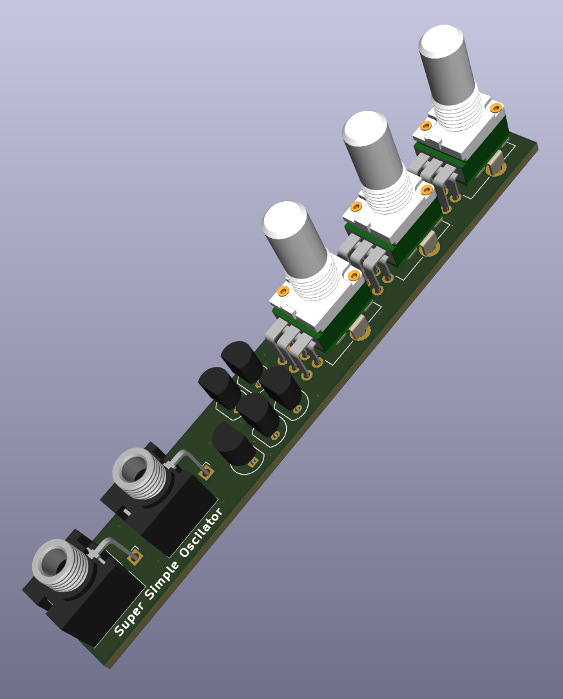
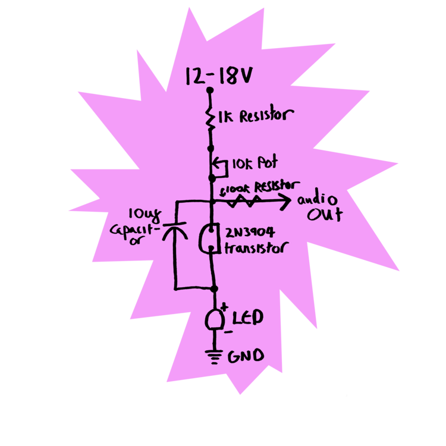

# eurorack-super_simple_oscillator

 

Eurorack modular synthesiser - Super Simple Oscillator

     

## About

A super simple oscillator module (avalanche vco) in eurorack format based the designs of [Look Mum No Computer](https://www.lookmumnocomputer.com/projects#/simplest-oscillator) and [kassutronics](https://kassu2000.blogspot.com/2018/07/avalance-vco.html).
This project is build with the opensource EDA [faerbyk](https://github.com/faebryk/faebryk).

## What can you do with this project?

You can use this project in various ways.
You can use it:

- as template for a faebryk project
- to build this VCO for your eurorack synth
- to design your own thing based on this design

## Working with the source files

See [here](./docs/development.md) for the instructions on how to install and edit this project.

## Building the SSO module

If you want to build a physical SSO eurorack module you can find the build instructions [here](./docs/build_instructions.md).

## Contibuting

If you want to share your alterations, improvements, or add bugfixes to this project, please take a look at the [contributing guidelines](./docs/CONTRIBUTING.md).

## Community Support

Community support is provided via Discord; see the Resources below for details.

### Resources

- Source Code: [https://github.com/ruben-iteng/eurorack-super_simple_oscillator](https://github.com/ruben-iteng/eurorack-super_simple_oscillator)
- Chat: Real-time chat happens in faebryk's Discord Server (chit-chat room for now). Use this Discord [Invite](https://discord.gg/95jYuPmnUW) to register
- Issues: [https://github.com/ruben-iteng/eurorack-super_simple_oscillator/issues](https://github.com/ruben-iteng/eurorack-super_simple_oscillator/issues)
