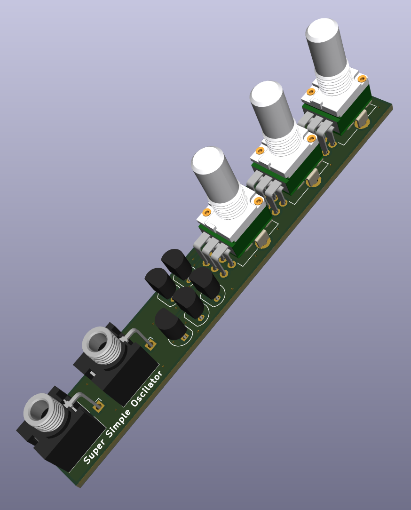

<div align="center">

# eurorack-super_simple_oscillator

## Eurorack modular synthesiser - Super Simple Oscillator


<br/>

A super simple oscillator module (avalanche vco) in eurorack format based the designs of [Look Mum No Computer](https://www.lookmumnocomputer.com/projects#/simplest-oscillator) and [kassutronics](https://kassu2000.blogspot.com/2018/07/avalance-vco.html).
This project is build with the opensource EDA [faerbyk](https://github.com/faebryk/faebryk)

[](https://github.com/ruben-iteng/eurorack-super_simple_oscillator/releases) [](https://github.com/ruben-iteng/eurorack-super_simple_oscillator/blob/main/LICENSE) [](https://github.com/ruben-iteng/eurorack-super_simple_oscillator/pulls) [](https://github.com/ruben-iteng/eurorack-super_simple_oscillator/issues) [](https://github.com/ruben-iteng/eurorack-super_simple_oscillator/commits/main) [](https://github.com/psf/black)

</div>

## About

@@@


## Prerequisites

To build this project you will need faebryk. The easiest way is to install it using pip.

```bash
> pip install faebryk
```

Running samples

```bash
> mkdir my_faebryk_project
> cd my_faebryk_project
> # download a sample from the github repo in /samples
> python3 <sample_name.py> | tail -n1 > netlist.net
```

### From source

Setup

```bash
> git clone git@github.com:ruben-iteng/eurorack-super_simple_oscillator.git
> cd faebryk
> git submodule init
> git submodule update
> pip install -r requirements.txt
```

Running samples

```bash
> ./samples/<sample_name>.py | tail -n1 > netlist.net
```

## Contibuting

See [CONTRIBUTING.md](docs/CONTRIBUTING.md)

### Running your own experiments/Making samples

First follow the steps in get running from source.
Then add a file in samples/ (you can use one of the samples as template).
Call your file with `python3 samples/<yourfile>.py`.

### Running tests

Setup

```bash
> pip install -r test/requirements.txt
```

Run

```bash
> python3 test/test.py
```

## Community Support

Community support is provided via Discord; see the Resources below for details.

### Resources

- Source Code: [https://github.com/ruben-iteng/eurorack-super_simple_oscillator](https://github.com/ruben-iteng/eurorack-super_simple_oscillator)
- Chat: Real-time chat happens in faebryk's Discord Server. Use this Discord [Invite](https://discord.gg/95jYuPmnUW) to register
- Issues: [https://github.com/ruben-iteng/eurorack-super_simple_oscillator/issues](https://github.com/ruben-iteng/eurorack-super_simple_oscillator/issues)